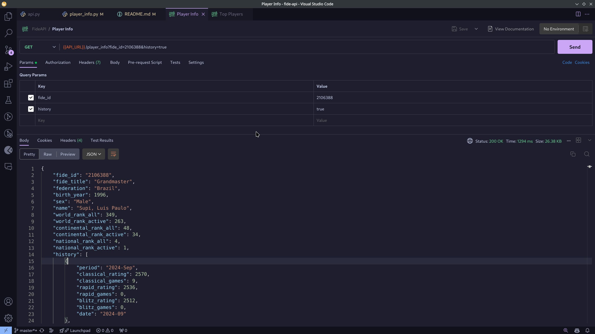

<h1 align="center">
  FIDE API
</h1>

<h4 align="center">Python FIDE scraper and HTTP API</h4>

<p align="center">
  <a href="#about">About</a> •
  <a href="#features">Features</a> •
  <a href="#usage">Usage</a> •
  <a href="#credits">Credits</a> •
  <a href="#license">License</a>
</p>



## About

Working with FIDE official data is not simple, mainly because they don't have an API. That's the reason I made a simple API with FastAPI to scrape the data from their own website and provide it as JSON over HTTP requests.

A Redis cache is implemented to provide faster lookups for common use cases.

## Features

Check it on:
[https://fide-api.vercel.app/docs](https://fide-api.vercel.app/docs)

- Get top players list
- Get player info
- Get player history

## Usage

### Docker (recommended)

You will need docker and docker-compose installed, from your terminal:

```sh
git clone https://github.com/cassiofb-dev/fide-api

cd fide-api

docker compose up -d
```

### Native

You will need git and python installed, from your terminal:

```sh
git clone https://github.com/cassiofb-dev/fide-api

cd fide-api

python -m venv venv

source venv/bin/activate

pip install -r requirements.txt

uvicorn src.api:app --reload
```

To see the docs go to ``localhost:8000/docs``

## Credits

This project uses git, python.

The following python dependecies were used:
```txt
annotated-types==0.7.0
anyio==4.6.0
beautifulsoup4==4.12.3
certifi==2024.8.30
charset-normalizer==3.3.2
click==8.1.7
fastapi==0.115.0
h11==0.14.0
idna==3.10
orjson==3.10.7
pydantic==2.9.2
pydantic_core==2.23.4
requests==2.32.3
sniffio==1.3.1
soupsieve==2.6
starlette==0.38.6
typing_extensions==4.12.2
urllib3==2.2.3
uvicorn==0.31.0
```

## License

MIT

---

> [Website](https://cassiofernando.com) &nbsp;&middot;&nbsp;
> GitHub [@cassiofb-dev](https://github.com/cassiofb-dev) &nbsp;&middot;&nbsp;
> Twitter [@cassiofb_dev](https://twitter.com/cassiofb_dev)
