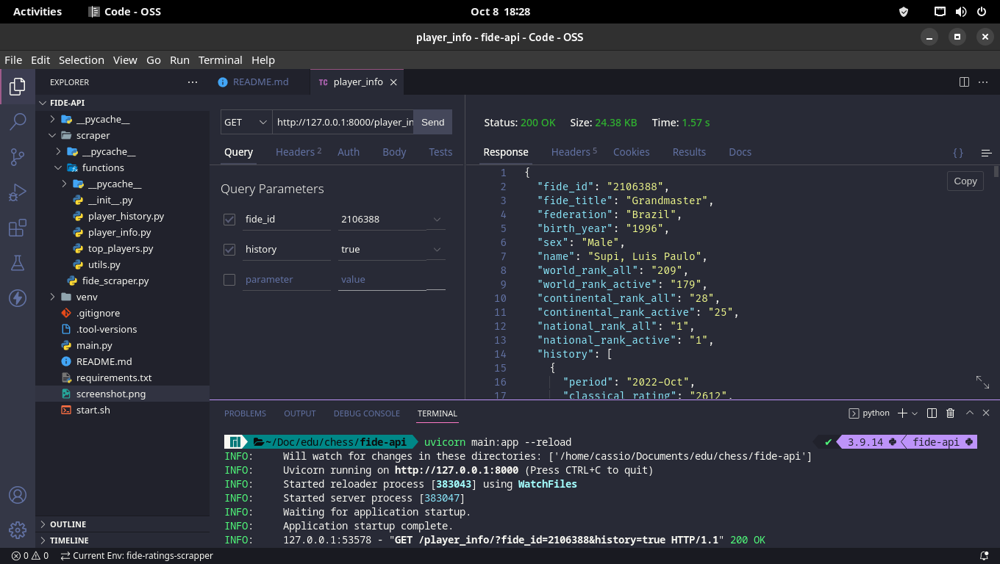

<h1 align="center">
  FIDE API
</h1>

<h4 align="center">Python FIDE scraper and HTTP API</h4>

<p align="center">
  <a href="#about">About</a> •
  <a href="#usage">Usage</a> •
  <a href="#credits">Credits</a> •
  <a href="#license">License</a>
</p>



## About

Working with FIDE oficial data is not simple, mainly because they don't have an API. That's the reason I made a simple API with FastAPI to scrape the data from their own website and provide it as JSON over HTTP requests.

## Usage

You will need git and asdf installed, from your terminal:

```sh
git clone https://github.com/cassiofb-dev/fide-api

cd fide-api

asdf install python 3.9.14

asdf local python 3.9.14

python -m venv venv

source venv/bin/activate

pip install -r requirements.txt

uvicorn main:app --reload
```

[](https://go.deta.dev/deploy?repo=https://github.com/cassiofb-dev/fide-api)

## Credits

This project uses git, python (3.10.7) and asdf.

The following python dependecies were used:
```txt
anyio==3.6.1
beautifulsoup4==4.11.1
certifi==2022.9.24
charset-normalizer==2.1.1
click==8.1.3
dnspython==2.2.1
email-validator==1.3.0
fastapi==0.85.0
h11==0.14.0
httptools==0.5.0
idna==3.4
itsdangerous==2.1.2
Jinja2==3.1.2
MarkupSafe==2.1.1
numpy==1.23.3
orjson==3.8.0
pandas==1.5.0
pydantic==1.10.2
python-dateutil==2.8.2
python-dotenv==0.21.0
python-multipart==0.0.5
pytz==2022.4
PyYAML==6.0
requests==2.28.1
six==1.16.0
sniffio==1.3.0
soupsieve==2.3.2.post1
starlette==0.20.4
typing_extensions==4.3.0
ujson==5.5.0
urllib3==1.26.12
uvicorn==0.18.3
uvloop==0.17.0
watchfiles==0.17.0
websockets==10.3
```

## License

MIT

---

> [Website](https://cassiofernando.netlify.app/) &nbsp;&middot;&nbsp;
> GitHub [@cassiofb-dev](https://github.com/cassiofb-dev) &nbsp;&middot;&nbsp;
> Twitter [@cassiofb_dev](https://twitter.com/cassiofb_dev)
